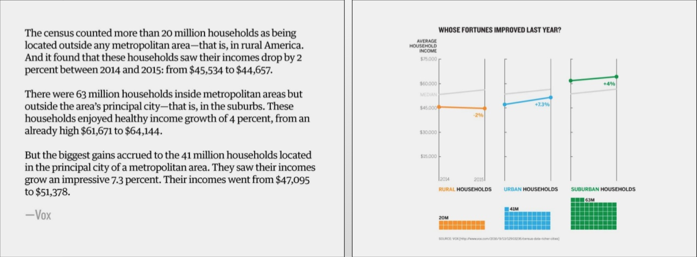
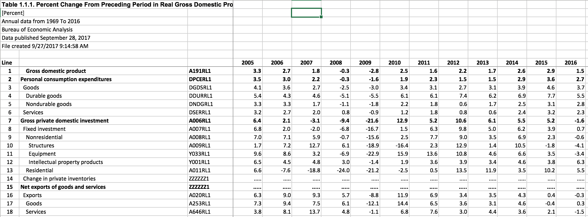

## DATA 608 BiWeekly Discussion

Every even week will involve a discussion on a visualization topic presented by Edward Tufte. The topics (as well as some additional context to serve as a discussion starter) are outlined below.

Each student will be required to be a "discussion leader" for one of these disucssions. A discussion leader will be required to bring a couple of visualization examples from the web related to the concept being discussed.

These discussions are meant to be very open-ended. If you agree with the concept, highlight examples that successfully implement the concept, or unsuccessful visualizations that fail to. If you don't agree with the concept (or think it's overrated,) come with counterexamples. Think about the concept and be prepared to comment on what other students bring.

One theme I'd like to bring into all of our discussions is how visualizations on the web differ from the largely static visualizations Tufte discusses. Do these concepts apply to interactive visualizations, or does interactivity totally change what's possible?

### Week 2: Data-Ink Ratio and ChartJunk

The first concept we'll be discussing is the data-ink ratio. This is a core concept of data visualization introduced by Edward Tufte that we'll be discussing in our first meetup, but in the meantime read [this page](https://infovis-wiki.net/wiki/Data-Ink_Ratio) for some background.

A related concept to the data-ink ratio is Chartjunk.

Tufte refers to Chartjunk as one of the major features you need to minimize in a chart. It can be any part of a visualization that doesn’t add to understanding the data behind it (and many times, actively obscures the understanding of that data.)

He refers to two types of Chartjunk directly:

- Unintentional Optical art: Either caused by using patterns to distinguish areas or grids.

- Self-Promoting Graphics: When data measures or structures themselves become design elements.

In addition, Tufte explains how design-based chart-junk in particular can be misleading. When data measures themselves are represented with design as the core concern, the visual effect might be misrepresented. In the below example, data is mapped to the areas of the road:

To preserve design, the data isn't properly represented. On the other hand, this same data can be represented in a visualization with chartjunk that is still superfluous, but not misleading:

### Week 4: High Resolution Graphics

Tufte devotes a chapter to high-resolution data graphics, and I would like to use this as an excuse to talk about visualizing large datasets in general.

Tufte focuses on data density: the number of datapoints displayed divided by the total chart area. When thinking of examples of visualizing large datasets, try to think of creative ways that a high data density can be displayed. There are lots of interactive elements that make higher density displays more successful online, but feel free to focus on strategies that might not be limited to an online medium. Perhaps a unique visualization method was used, or there is a quality of the data that lends itself to being more clear as a dense visualization.

For example: Tufte uses a New York weather chart as an example of a dense visualization.

This image is fairly dense, but because it is displaying weather, the inherent seasonality makes it easier to read.

Think about the ways visualizations can aggregate data as well. Basic types of aggregation visualization types include histograms (to aggregate large data across a single dimension) or heatmaps (to aggregate large data across two dimensions.) Any visualization type can be used to visualize aggregated data however. When asking questions of large datasets, not only is there a choice of visualization type, but a choice of aggregation.

Think of unique strategies you've seen applied to big data. One example I use with clients at Plotly that goes beyond basic aggregation is a fake signal with random spikes added. Plotting out all the points results in a visualization that's pretty busy:

Simply aggregating the data would preserve the patterns, but make us lose information about the spikes. To preserve more information, we could combine an aggregation with some other way to highlight spikes:

This results in a cleaner visualization with minimal information loss.

### Week 6: Small Multiples

We talked about small multiples during our meetup, but check out [this link](http://www.juiceanalytics.com/writing/better-know-visualization-small-multiples) for some more information on them.

In particular, pay attention to the specifics of Tufte's definition of small multiples: The small multiples can either be mapped to a quantitative variable not shown in the individual images, or it can be used to show motion over time, like frames in a movie. Keep theese distinctions in mind when talking about how the usefulness of small multiples changes in an interactive environment.

Think of tools like ggplot (facet_wrap or facet_grid) or Tableau. A lot of visualization packages have begun standardizing the concept of small multiples. Is this a good thing? Or does this lead to their overuse?

### Week 8: Multifunctional Graph Elements

This week we'll be talking about multifunctioning graph elements. Edward Tufte explains two major ways that graph elements can be multifunctioning: building data measures out of the data or allowing the grid to report directly on the data.

This can be seen as an extension of maximizing the data-ink ratio. If you have multifunctioning graph elements, then you can communicate more using less ink

Tufte gives a few examples of both of these (along with a really weird digression into "Chernoff faces": an attempt to encode data onto human-like faces!) The simplest way of integrating data measures out of the data itself is to simply display numerical values instead of points. This can be simply incorporated into a scatter plot, or in histograms, as this example shows the growing presence of American army divisions in France:

You can even get more creative with integrating the data itself into your display. In this "living histogram", the individuals themselves serve as datapoints in a histogram, showing the bimodal distribution of heights associated with men and women:

Grids themselves can show data as well. Tufte gives a few examples of this. Vector diagrams are a common use case of displaying magnitude and direction of energy fields within the grid itself:

Tufte also shows a creative example of using a grid to display the geographic inaccuracies of a historic map:

### Week 10: Aesthetics and Technique

The last chapter of Tufte's Visual Display of Quantitative Information Explains Aesthetics and Technique. He talks about a few qualities such as balance and professionalism in a visualization, but one tangible concept he talks about is the choice of design. Starting out with decisions on the placement of labels and text within a graph, he blurs the line between prose, data tables, and data visualizations. While we talked about how data visualizations can convey information more concisely than prose:

Tufte explains how text, in particular data tables, may sometimes be clearer. He gives the example of localized comparisons in a table. Economic releases, for example, are usually hierarchical and can be best represented in tables:

Rather than just looking at individual visualizations, visualizations interspersed in text themselves can be designed for maximum impact, as he shows from images of Leonardo Davinci's manuscripts:

More recently, the designer Nicholas Rougeux reproduced the first six books of [The Elements of Euclid](https://www.c82.net/euclid/), a textbook published in 1847 and written by Oliver Byrne. This is an incredible example of how this sort of design can work with interactive elements.

</img>

For this week's discussion, I want you to think about data driven journalism, or other data driven narratives. For examples, think about entire features - including text, tables, and visualizations together - that work (or don't work) in an interactive context.

### Week 12: Time, and Pictorial Instructions

Edward Tufte devotes a chapter in "Visual Explanations" to pictorial instructions. That topic itself is fairly niche, but Tufte generalizes it a bit. For the purposes of this discussion, I'd like to expand this to include visualizing movement or time.

Tufte shows a few examples of how motion can be shown with static images. He makes a comparison between visualizations of magic tricks:

To a Phillips Curve, one of my personal favorite subject matter specific visualizations:

In both cases, motion is being shown in a unique way. The Phillips curve is even more subtle: the "path" of the line adds a third variable to a line chart that normally would only be able to show two dimensions.

Try to focus more on how time is shown in data visualization rather than pictorial representations (though if anyone has anything interesting to say about magic and magicians feel free to!) Think about unique examples of time or motion being shown, and how it might be improved using a more interactive medium.
